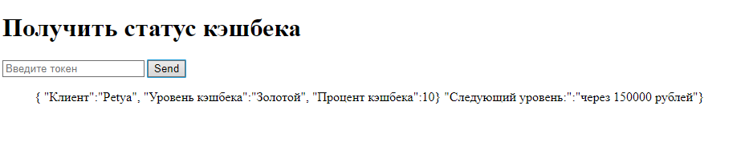

# Лабораторная работа №9. REST-сервис
## Выполнила: Гиниятуллина Юлия Сергеевна

Для запуска проекта необходимо установить пакет uvicorn при помощи команды 

```  $ pip install uvicorn ```

После чего проект можно будет запустить командой

```  uvicorn main:app --reload ```

из главной директории

После этого Вы сможете найти главную страницу сайта по локальному адресу [http://127.0.0.1:8000](http://127.0.0.1:8000)

## Использование

Главная страница сайта содержит ссылки на свои подстраницы и инструкцию по использованию

  <h4>Для получения данных об уровнях кэшбеков необходимо выполнить несколько простых действий:</h4>
  <ol>
  <li>Перейти по ссылке, получить токен по логину и паролю</a>. Ввести логин и пароль существующего пользователя</li>
  <li>Получить токен и скопировать его, используя кнопку-ссылку.</li>
  <li>Перейти по ссылке и узнать статус по токену.</li>
  <li>Ввести полученный токен.</li>
  </ol>

  
  <h4>Список предварительно зарегистрированных пользователей:</h4>
  
  <ul>
      <li>Логин: 'Admin', Пароль: 'admin'</li>
      <li>Логин:'Petya', Пароль: 'qqqwww12!'</li>
      <li>Логин:'NewPerson', Пароль: 'Password'</li>
      <li>Логин:'NewPerson2', Пароль: 'addingnewperson'</li>
  </ul>


## Демонстрация работы:




